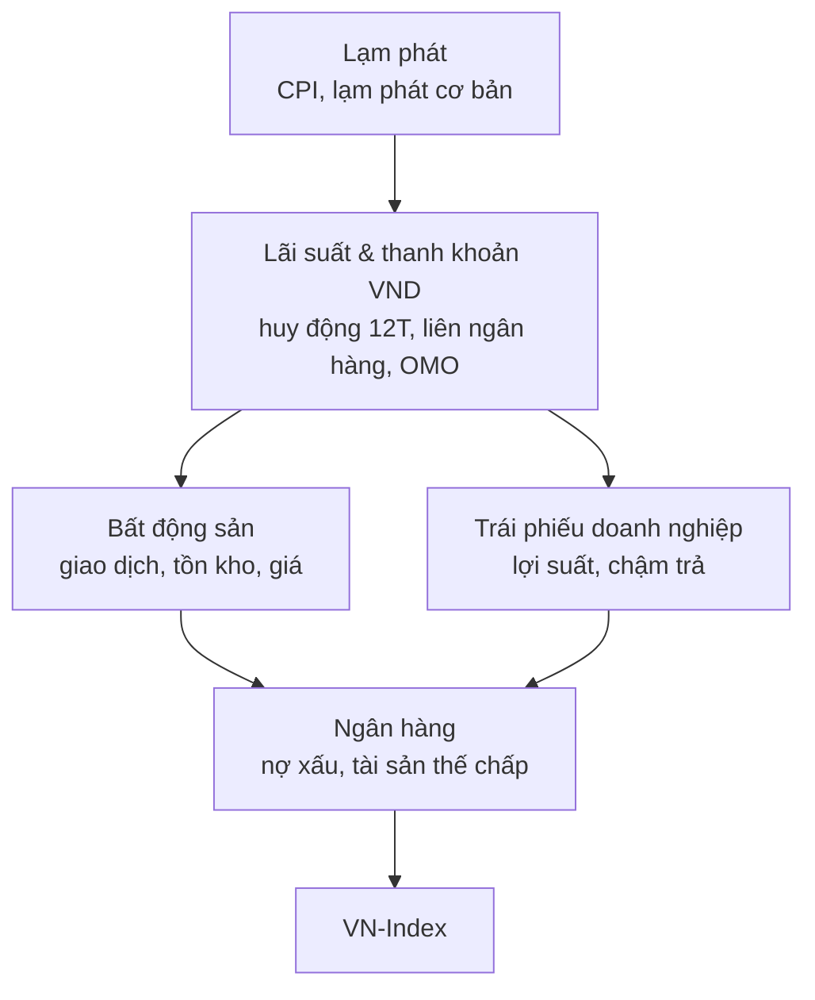

Nguồn: Lesson 1, Lesson 2, các buổi về Stage 4, dấu hiệu tạo đỉnh, chân sóng (18–19/9), Fed & nâng hạng. Đặc thù VN chi tiết xem trang 08.

# 1. Chu kỳ 4 giai đoạn (Weinstein / Wyckoff)

![[01_chu_ky_4_stage.svg]]

Ghi chú gốc: _Giảm giá → Tích luỹ → Tăng giá → Phân phối → Giảm giá_. Cách đánh số chuẩn bắt đầu từ **tích luỹ**.

|Stage|Wyckoff|MA200 / MA30 tuần|Hành động|
|---|---|---|---|
|**1 — Tích luỹ (nền đáy)**|Accumulation|Phẳng dần, giá cắt qua lại|Lập watchlist, chờ pivot, chưa vào toàn bộ|
|**2 — Tăng giá**|Markup|Dốc lên, giá nằm trên|Giai đoạn duy nhất nên nắm giữ vị thế mua|
|**3 — Phân phối (nền đỉnh)**|Distribution|Đi ngang trở lại|Thoát hàng, không mua mới|
|**4 — Giảm giá**|Markdown|Dốc xuống, giá nằm dưới|Chỉ quan sát, tuyệt đối không bắt đáy|

- **Công cụ xác định nhanh nhất:** độ dốc MA200 (hoặc MA30 tuần ≈ MA150 ngày) + vị trí giá so với nó.
- MA phẳng + giá quanh MA → Stage 1 hoặc 3; phân biệt bằng giai đoạn **trước đó** (trước là giảm → Stage 1; trước là tăng → Stage 3).
- Stage 3 nguy hiểm hơn Stage 4 vì trông giống Stage 1. Phân phối thường có volume lớn ở các phiên giảm.
- Phần lớn tiền kiếm được ở Stage 2; phần lớn tiền mất do mua ở Stage 3 tưởng là Stage 1.
- Phần lớn thời gian thị trường ở Stage 1 và 3 → kiên nhẫn là điều kiện toán học, không phải đức tính.
- Vị trí trong chu kỳ quyết định ý nghĩa tín hiệu: cùng một cây nến, cùng mức volume, ở Stage 1 và Stage 3 nói hai điều ngược nhau.

## Dấu hiệu từng giai đoạn

**Stage 4 — không mua**

- MA dốc xuống, giá dưới MA
- Đỉnh sau thấp hơn, đáy sau thấp hơn
- Nhịp hồi yếu, dừng ngay dưới MA (MA thành kháng cự)
- Vol lệch về phía bán; breakdown vol thấp vẫn nguy hiểm
- RS đi xuống; tin tốt không tăng
- "Ngưng giảm 2–3 phiên" ở đây thường chỉ là nghỉ giữa nhịp

**Stage 1 — chuẩn bị**

- MA phẳng dần; ngưng giảm; vol bán cạn (VDU)
- Tin xấu mà không giảm; biên độ nén dần

**Stage 2 — nắm giữ**

- Breakout kèm vol lớn; ưu tiên cổ dẫn đầu
- Mã không giảm khi thị trường rũ
- Điều chỉnh về MA20/MA50 vol thấp = cơ hội mua thêm

**Stage 3 — thoát**

- Vol lớn mà giá đứng yên (churning)
- Tin tốt mà không tăng; đỉnh sau không cao hơn
- Sóng hồi = phân phối nốt
- Điều chỉnh "quá đẹp", bán quá ít → cảnh giác
- Mất MA50 = tín hiệu

## Khi nào Stage 4 kết thúc

Stage 4 không chuyển thẳng sang tăng — phải đi qua Stage 1.

1. Giá ngừng tạo đáy mới, bắt đầu đi ngang thành nền.
2. MA30 tuần dốc xuống chậm dần rồi đi ngang (tư duy **đạo hàm bậc hai**: tốc độ xấu đi đang giảm).
3. Volume các phiên giảm co lại, cạn dần qua **nhiều tuần** (không phải vài phiên).
4. Giá dao động quanh MA thay vì bị MA đè xuống; đi ngang biên hẹp ít nhất 4–6 tuần.
5. Chỉ khi giá **vượt nền Stage 1 lên trên MA đã chuyển dốc lên, kèm vol lớn** → Stage 2.

- Sau cú sập trên 60% từ đỉnh, nền Stage 1 thường kéo dài 3–6 tháng hoặc hơn. MA dốc xuống cần giá đi ngang ít nhất 3–4 tuần để bắt kịp.
- Bán tháo đỉnh điểm (selling climax) chỉ đánh dấu _bắt đầu_ Stage 1, chưa phải điểm mua; thường cần nhiều tuần xây nền và test lại đáy.

# 2. Ba loại sóng hồi

|Loại|Bối cảnh|Đặc điểm|Ý nghĩa|
|---|---|---|---|
|Hồi kỹ thuật trong Stage 4|Sau nhịp giảm mạnh|Vol thấp, hồi 30–50% nhịp giảm, không vượt MA50|Bẫy — giảm tiếp|
|Phân phối nốt cuối Stage 3|Sau sóng tăng dài|Đỉnh sau thấp hơn, vol lớn mà không đi được|Thoát hàng|
|Điều chỉnh lành mạnh trong Stage 2|Giữa xu hướng tăng|Về MA20/MA50, vol cạn dần, giữ hỗ trợ|Cơ hội mua thêm|

Biến số phân biệt: giai đoạn chu kỳ + hành vi volume khi hồi + có giữ được MA quan trọng không. Chi tiết dự báo nhịp hồi xem trang 03.

# 3. Dấu hiệu tạo đỉnh thị trường

Đỉnh là một **quá trình phân phối** kéo dài vài tuần đến vài tháng (hưng phấn → phân phối, đỉnh thấp dần → gãy cấu trúc), không phải một điểm. Đọc theo chuỗi.

## Nhóm 1 — Giá và khối lượng

- Đỉnh sau thấp hơn đỉnh trước (lower high) — cơ bản nhất
- Volume đạt đỉnh rồi giảm trong khi giá vẫn cố lên
- Churning: vol rất lớn, giá đứng yên → bên bán hấp thụ toàn bộ lực mua
- Distribution days (O'Neil): 4–5 phiên chỉ số giảm kèm vol tăng trong 4–5 tuần
- Failed breakout / bull trap: vượt đỉnh rồi rơi lại trong 1–3 phiên
- Thủng MA20 → MA50, MA bẻ ngang rồi dốc xuống (muộn nhưng tin cậy)
- Phân kỳ âm RSI/MACD khung tuần

## Nhóm 2 — Độ rộng thị trường (hay bị bỏ qua)

- A/D line đi xuống khi chỉ số lập đỉnh; chỉ số được giữ bởi 2–3 trụ, bảng điện đỏ
- % cổ phiếu trên MA50/MA200 giảm dần; số mã lập đỉnh 52 tuần thu hẹp
- Nhóm dẫn dắt cũ mất vai trò, không có nhóm mới thay thế

## Nhóm 3 — Dòng tiền và tâm lý (cảnh báo sớm nhất ở VN)

- Dư nợ margin kỷ lục; tài khoản mới tăng vọt, F0 đổ vào
- Junk rally: penny tăng trần hàng loạt trong khi bluechip đứng im
- Phát hành tăng vốn, IPO dồn dập; nội bộ đăng ký bán
- Khối ngoại bán ròng kéo dài; truyền thông hưng phấn, mục tiêu chỉ số tròn trịa

## Nhóm 4 — Vĩ mô

Lãi suất liên ngân hàng tăng, tỷ giá căng buộc NHNN hút tiền, tăng trưởng lợi nhuận chạm đỉnh, P/E vượt xa trung bình lịch sử, rủi ro chính sách (siết tín dụng BĐS/trái phiếu).

## Checklist đỉnh — từ 5–6 dấu hiệu trở lên thì hạ tỷ trọng theo bậc thang

- [ ] Đỉnh sau thấp hơn đỉnh trước
- [ ] ≥4 distribution days trong 4 tuần
- [ ] Thủng MA20 kèm volume lớn
- [ ] Độ rộng phân kỳ với chỉ số
- [ ] Margin kỷ lục
- [ ] Penny/đầu cơ dẫn sóng
- [ ] Khối ngoại bán ròng kéo dài
- [ ] Phát hành tăng vốn ồ ạt
- [ ] Nội bộ đăng ký bán
- [ ] Phân kỳ âm khung tuần

Mục đích không phải bắt đúng đỉnh mà buộc giảm rủi ro khi bằng chứng tích luỹ dần. Đỉnh chỉ được xác nhận sau khi đã hình thành.

# 4. Chân sóng VN-Index

**Vĩ mô cho xác suất, kỹ thuật cho thời điểm.** Chân sóng = điểm chuyển Stage 1 → Stage 2 ở cấp toàn thị trường. Vĩ mô cải thiện cũng chỉ là trạng thái chờ; luôn cần trigger kỹ thuật.

## Chuỗi truyền dẫn vĩ mô đặc thù Việt Nam

VN-Index về bản chất là **chỉ số của hệ thống tín dụng** (ngân hàng, BĐS, chứng khoán chiếm phần lớn vốn hoá).

- Đảo chiều thật chỉ hình thành khi **van đầu nguồn đảo chiều trước** rồi truyền xuống. Đảo chiều từ dưới lên ("ngân hàng tăng nên thị trường tạo đáy") hầu như luôn là sóng hồi.
- **Đọc đạo hàm bậc hai, không đọc mức tuyệt đối:** thị trường tạo đáy khi mọi thứ ngừng xấu đi nhanh hơn, không phải khi mọi thứ tốt lên. Chờ số liệu BĐS đẹp là vào muộn 6–9 tháng.

## Ba van cơ bản

1. **Lạm phát (van gốc):** CPI so cùng kỳ tạo đỉnh rõ và giảm 2–3 tháng liên tiếp, lạm phát lõi đi ngang/giảm, khoảng cách với mục tiêu nới rộng.
2. **Lãi suất & thanh khoản VND:** nhìn lãi suất huy động 12 tháng, chênh lệch tăng trưởng tín dụng–huy động, trạng thái ròng OMO (bơm hay hút), không nhìn lãi suất điều hành.
3. **BĐS & trái phiếu (kênh tài sản thế chấp):** vòng xoáy BĐS mất thanh khoản → chủ đầu tư cạn tiền → TPDN chậm trả → ngân hàng trích lập → tín dụng thắt. **Chỉ báo đáy tốt nhất là lợi suất TPDN, không phải giá nhà** (2022: lợi suất TPDN bình quân chạm 28%, VN-Index chạm đáy 15/11/2022, sau đó lợi suất hạ dần về 16%). Tín hiệu đáy khác: default chậm lại, spread với TPCP thu hẹp, doanh nghiệp quay lại **phát hành mới**; BĐS: thanh khoản phân khúc nhu cầu thực tăng trước giá.

## Năm pha kỹ thuật của chân sóng — bản Việt Nam

|Pha|Bản gốc (Weinstein/O'Neil)|Biến dạng trên HOSE|
|---|---|---|
|1. Bán tháo cưỡng bức|Một phiên vol cực đại, nến búa dài|Biên ±7% kéo panic thành chuỗi 3–5 phiên sàn. Tín hiệu thật: phiên dư bán sàn hàng chục triệu cp bị hấp thụ hết, đóng cửa thoát sàn với vol kỷ lục|
|2. Cạn cung|Vol co về mức thấp|Phải tách thỏa thuận; đáy hay đi kèm thỏa thuận đột biến (chuyển nhượng cổ phiếu thế chấp, tái cơ cấu quỹ) làm vol thô trông như "gom hàng" giả|
|3. Kiểm định đáy|Retest với vol thấp hơn|Retest thường thủng đáy cũ 1–3% rồi bật (stop đặt dày dưới đáy)|
|4. Follow-Through Day|Phiên tăng ≥1,5% với vol tăng, ngày 4–7 của nhịp hồi|FTD luôn bị test ở D+2/D+3. **Chỉ hợp lệ nếu giữ được đáy phiên FTD khi hàng T+2 về**|
|5. Xác nhận độ rộng|Nhóm dẫn dắt phá nền|Xác nhận bằng VNMID/VNSML và % mã trên MA50, không bằng điểm số|

Ví dụ độ rộng tháng 7/2026: VN-Index giảm 6,68% nhưng VNMID giảm 11,64%, số mã giảm gấp hơn 2,6 lần số mã tăng — nhìn điểm số thì "chỉnh bình thường", nhìn độ rộng là sát thương diện rộng.

## Bảng chấm điểm chân sóng (8 tiêu chí)

- [ ] CPI tạo đỉnh, giảm 2–3 tháng (đạo hàm bậc hai âm)
- [ ] Lãi suất huy động tạo đỉnh, NHNN bơm ròng
- [ ] Tỷ giá ổn định
- [ ] Lợi suất TPDN tạo đỉnh rồi hạ
- [ ] Thanh khoản BĐS tạo đáy (giao dịch tăng trước giá)
- [ ] Bán tháo cưỡng bức đã xảy ra (chuỗi sàn, giải chấp diện rộng, margin giảm 20–30% từ đỉnh)
- [ ] Định giá hấp dẫn (P/E dưới khoảng 13)
- [ ] Khối ngoại mua ròng **chủ động** (không phải dòng thụ động)

Đối chiếu 19/9/2026: đạt 1,5/8 → **không phải chân sóng**.

## Thứ tự để chân sóng thật hình thành (không được đảo)

1. Áp lực leo thang trước (sự cố tín dụng/đáo hạn trái phiếu, tỷ giá buộc NHNN thắt mạnh) → giải chấp diện rộng
2. Chuỗi phiên sàn, dư bán sàn khổng lồ, margin toàn thị trường giảm 20–30%
3. CPI tạo đỉnh, NHNN chuyển từ hút ròng sang bơm ròng
4. Lợi suất TPDN tạo đỉnh rồi hạ, lãi vay mua nhà dưới 10%
5. Khi đó mới tìm FTD và kiểm tra điều kiện T+2

Chưa có bước 1–2 thì mọi nhịp hồi là sóng hồi trong xu hướng chưa rõ: vị thế nhỏ, cắt lỗ chặt.

## Case chân sóng tham chiếu: đáy 4/2025

- Vĩ mô: sốc thuế đối ứng (2/4/2025) đẩy bất định lên cực đại, rồi hoãn 90 ngày → chuyển từ leo thang sang đàm phán.
- Định giá: P/E tại đáy 10,6 lần so với trung vị 10 năm 14,4 lần.
- Kỹ thuật: thanh khoản gần 90.000 tỷ trong 2 phiên cuối tuần — capitulation volume kinh điển. Từ đáy, VN-Index tăng hơn 50%.
- Đối chiếu 2022: khối ngoại mua ròng khoảng 30.000 tỷ (11/2022–1/2023) khi P/E 12–15 lần = mua **chủ động vì rẻ**, khác hẳn dòng thụ động FTSE.

# 5. Tin đã biết trước, "sell the news" và câu chuyện nâng hạng

- **Tin đã được định giá:** Fed tăng 25bps (16/9/2026) với xác suất thị trường đã định giá khoảng 90% → VN-Index vẫn tăng 2 phiên sau. Phản ứng giá xảy ra _trước_ ngày công bố.
- **Nâng hạng FTSE Russell:** công bố 10/2025, hiệu lực 21/9/2026; giải ngân 4 đợt (10% từ 21/9/2026, 20% từ 22/3/2027, 35% từ 21/6/2027, 35% từ 20/9/2027). Giao dịch cơ cấu của quỹ hoàn tất sau phiên 18/9 → **lực mua cơ học kết thúc trước ngày hiệu lực**. Con số "vài tỷ USD" là tổng cả lộ trình; đợt đầu chỉ khoảng 145–212 triệu USD và tập trung lệch (VIC+VHM khoảng 45% tổng giải ngân, top 10 mã khoảng 75%).
- **Vào rổ ≠ tăng giá:** trong 27 mã FTSE All-Cap chỉ 9 mã từng lập kỷ lục giá từ đầu 2026. Danh sách dùng để **thu hẹp watchlist**, sau đó vẫn chạy đủ checklist.
- **Thống kê lịch sử:** trung vị biến động 12 tháng sau ngày hiệu lực nâng hạng ở các thị trường trước đây là −10,5%; VN-Index đã tăng khoảng 10,3% trong 11 tháng trước đó (cao nhất nhóm so sánh) → rủi ro sell the news cao hơn trung bình. Đây là cảnh báo, không phải tiên đoán.
- FTSE ≠ MSCI: hai tổ chức độc lập; FTSE nâng hạng không kéo theo MSCI.
- **Chốt lời/điều chỉnh** (giảm 3–8%, vol co lại) ≠ **bán tháo** (thủng hỗ trợ kèm vol bán tăng vọt vì lo ngại thực). Để giá tự nói, không đoán ngày đảo chiều.
- Phiên ATC thứ Sáu trước ngày hiệu lực (18/9) biến động do cơ cấu quỹ → chưa đủ cơ sở gọi là phân kỳ xấu; phản ứng thật chỉ đọc được sau khi dòng tiền cơ cấu xong.

# 6. Nguyên tắc thị trường từ Lesson 1–2

- Con sóng cuối năm: **phân hoá** — có nền tảng, dẫn dắt → tăng; không đủ lực → giảm. Đo phân hoá bằng độ rộng (A/D, % mã trên MA50/MA200), không bằng cảm nhận. VN-Index tăng mà số mã giảm nhiều hơn là cảnh báo sớm.
- Sẽ có một **nhịp rũ trước khi thực sự vào sóng tăng**.
- **Đừng đi theo thị trường** (theo đám đông → chết chùm) — nghĩa là đừng chạy theo tâm lý đám đông, không có nghĩa bỏ qua xu hướng chỉ số (xu hướng VN-Index là bộ lọc bắt buộc).
- Các yếu tố cần quan tâm: vĩ mô, chính sách, dòng tiền, kỹ thuật — xem khung 4 tầng ở trang 07.
- Thị trường rung lắc tại vùng cản = giai đoạn quan sát, chưa phải hành động.