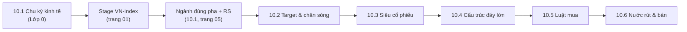

**Trang tổng quan Lesson 5 (30/9/2026).** Nội dung chia thành 6 bài con: 10.1 là chu kỳ kinh tế và luân chuyển ngành, 10.2–10.6 là 5 buổi "săn siêu cổ phiếu". Mỗi bài có case cổ phiếu Việt Nam kèm mốc thời gian. Theo quy tắc chống trùng lặp, trang này chỉ giữ lộ trình, bản đồ liên kết và bảng ngộ nhận chung; kiến thức chi tiết nằm ở bài con.

# Vị trí trong khung top-down

# Bản đồ bài học

|Bài|Câu hỏi trả lời|Case Việt Nam chính|Liên kết kiến thức cũ|
|---|---|---|---|
|**10.1** Chu kỳ kinh tế & luân chuyển ngành|Ngành nào có gió thuận ở pha hiện tại?|Chứng khoán 15/3/2023, phân bón 4/2022, HPG 2021–2023, FPT 2024–2025, định vị 9/2026|Trang 01 §4 (chuỗi truyền dẫn vĩ mô), trang 05 (RRG)|
|**10.2** Buổi 1 — Target & chân sóng|Mã nào đáng theo dõi, khi nào nó rời Stage 1?|VIC 3/2025, chứng khoán 3/2023, HPG 11/2022; phản ví dụ phân bón 8/2022, PNJ 7/2026|Trang 01 §4 (chân sóng VN-Index), trang 09 (PNJ)|
|**10.3** Buổi 2 — Siêu cổ phiếu|Mã nào có chân dung siêu cổ phiếu, thuộc kiểu nào?|VIX 2023/2025, FPT 2024, HPG 2021, VIC 2025|Trang 07 §2 (cổ dẫn đầu), trang 05 (RS)|
|**10.4** Buổi 3 — 7 cấu trúc đáy lớn|Nền nào đủ lớn để bùng nổ theo đà?|VIC (Wyckoff) 2024–2025, VN-Index đáy V 3/2020 và 4/2025|Trang 03 (cốc tay cầm, VCP, spring, throwback)|
|**10.5** Buổi 4 — Luật mua|Mua bao nhiêu, ở đâu, mấy lần?|Ví dụ số kim tự tháp theo T+2; VN-Index hồi 6/2022|Trang 07 §3–5 (điểm mua, stop, size)|
|**10.6** Buổi 5 — Nước rút & bán|Giữ đến khi nào, bán thế nào?|DPM, DGC, HPG 2022; FPT 2025; VIX 2024; VIC cuối 2025|Trang 01 §3 (đỉnh thị trường), trang 07 §6 (bán theo tầng)|

# Lộ trình học đề xuất

- **Tuần 1:** đọc 10.1, làm 5 bài tập backtest ở mục 6 của 10.1; lập bảng pha chu kỳ tháng 10/2026.
- **Tuần 2:** đọc 10.2 và 10.3; chạy phễu lọc, lập watchlist A/B/C từ 2–3 ngành đã duyệt; phân loại kiểu A/B/C cho từng mã.
- **Tuần 3:** đọc 10.4; với mỗi mã trong watchlist A, gọi tên cấu trúc và đánh dấu pivot.
- **Tuần 4:** đọc 10.5 và 10.6; viết phiếu lệnh và kế hoạch bán cho 2–3 mã trước khi có tín hiệu.
- Mùa BCTC quý III/2026 (đến cuối tháng 10) là thời điểm tốt để thực hành 10.3 và 10.5.

# Những ngộ nhận thường gặp

|Ngộ nhận|Thực chất|Case|
|---|---|---|
|"GDP tăng mạnh thì chứng khoán tăng"|GDP là biến trễ; lãi suất – tín dụng mới là biến dẫn|2026: GDP 6 tháng +8,18% nhưng thị trường hụt hơi sau nâng hạng|
|"Ngành phòng thủ không giảm"|Ở VN đồng pha cao: phòng thủ chỉ giảm ít hơn; tiền mặt mới là phòng thủ thật|2022: VN-Index −32,8%|
|"Cổ chu kỳ P/E thấp là rẻ"|Cuối chu kỳ lợi nhuận đỉnh → P/E thấp giả|DPM P/E 4,4 (31/5/2022) rồi giảm khoảng 45%|
|"Lợi nhuận kỷ lục thì giá sẽ tăng"|Giá phản ánh tốc độ thay đổi, không phản ánh mức|HPG, DGC: lãi kỷ lục khi giá đang giảm|
|"Ngành đúng pha thì mã nào cũng tăng"|Chỉ top 1–3; mã yếu trong ngành mạnh vẫn là mã yếu|Chứng khoán 2023: VIX vượt trội cả nhóm|
|"Siêu cổ phiếu phải rẻ"|Thường P/E cao, giá gần đỉnh 52 tuần|FPT lập đỉnh liên tục năm 2024|
|"Tin hỗ trợ sẽ tạo đáy"|Tin hỗ trợ không đảo được Stage 4|PNJ 7/2026: mua lại cổ phiếu sau 3 phiên sàn|
|"Đáy V là điểm mua tốt nhất"|Không kiểm chứng được khi đang hình thành; chờ nền cao|VN-Index 3/2020, 4/2025|
|"Mua đủ 100% ở điểm đẹp nhất"|Mua kim tự tháp theo nhịp T+2|Ví dụ số ở 10.5|
|"Bán khi thấy nến đỏ đầu tiên"|Bán theo tín hiệu (climax, biến số dẫn dắt, trailing, stop)|Luật 8 tuần ở 10.6|

Ghi chú học tập cá nhân, không phải khuyến nghị đầu tư. Mã cổ phiếu chỉ là ví dụ minh hoạ; giá nêu trong các bài là giá danh nghĩa tại thời điểm theo nguồn, chưa điều chỉnh cổ tức/thưởng. Định vị chu kỳ là diễn giải tại 30/9/2026 và cần cập nhật hàng tháng.

[[10.1 · Chu kỳ kinh tế & luân chuyển ngành — chuyên sâu]]

[[10.2 · Xác định target cổ phiếu & nhận diện chân sóng]]

[[10.3 · Phát hiện sớm siêu cổ phiếu trong uptrend]]

[[10.4 · Bùng nổ theo đà- 7 cấu trúc tạo đáy lớn]]

[[10.5 · Định luật mua siêu hạng (chuyên sâu)]]

[[10.6 · Kỹ thuật nước rút & thời điểm bán]]